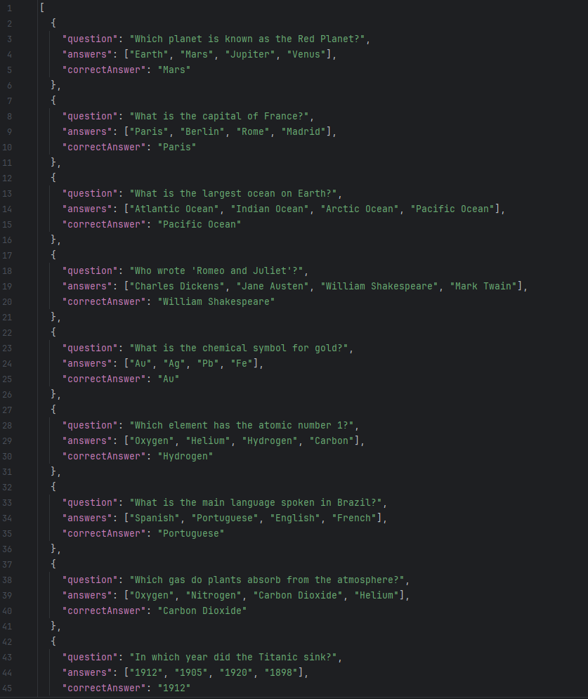
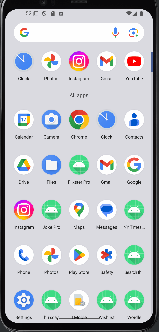
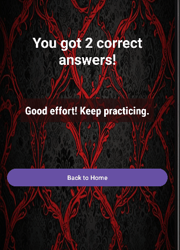

# Extra Credit Challenge: Thursday Night Trivia

Course Link: [CodePath Android Course](https://courses.codepath.org/courses/and102/unit/4#!labs)

Submitted by: **Tsewang Sherpa** <!-- Replace 'Your Name Here' with your actual name -->

**Thursday Night Trivia** is an app designed to present trivia questions, allow users to answer them, and provide results at the end.

Time spent: **3** hours spent in total <!-- Replace 'X' with the number of hours you spent on this project -->

## Application Features

### Required Features

The following **required** functionality is completed:

- [X] (2 pts) **Create a JSON file with at least 25 trivia questions.**
    - The JSON file contains trivia questions with 4 possible answers and a correct answer.
    -  <!-- Replace this link with your actual image/GIF link -->

- [X] (2 pts) **Create a Welcome Activity with trivia info and start button.**
    - The Welcome Activity provides trivia details and a start button to begin the quiz.
    -  <!-- Replace this link with your actual image/GIF link -->

- [X] (2 pts) **Randomly select and display 5 trivia questions.**
    - Each question loads in a separate activity, showing the trivia question and answers.
    -  <!-- Replace this link with your actual image/GIF link -->

- [X] (2 pts) **Display results at the end of the quiz.**
    - Results Activity shows the number of correct answers, percentage, and a dynamic message based on performance.
    -  <!-- Replace this link with your actual image/GIF link -->

- [X] (2 pts) **Display a dynamic message based on the user’s performance.**
    - Dynamic messages like "Great Job!" or "Better luck next time!" based on user score.
    -  <!-- Replace this link with your actual image/GIF link -->


## Stretch Features:

- [X] (+2 pts) **Add animations between questions for a smoother experience.**
  - Transitions between questions include animations for a better user experience. 
  - Added Colors to show if answer is right or wrong.
  - 

## Resources

- [Converting JSON to Models](https://guides.codepath.org/android/converting-json-to-models)
- [Gson](https://guides.codepath.org/android/Leveraging-the-Gson-Library#parsing-the-response)
- [Kotlin Serialization](https://github.com/Kotlin/kotlinx.serialization/blob/master/docs/serialization-guide.md)
- [Using Intents to Pass Data](https://guides.codepath.org/android/Using-Intents-to-Create-Flows)
- [SharedPreferences for Saving Data](https://developer.android.com/training/data-storage/shared-preferences)

## License

```plaintext
    Copyright [2024] [Tsewang Sherpa]

    Licensed under the Apache License, Version 2.0 (the "License");
    you may not use this file except in compliance with the License.
    You may obtain a copy of the License at

        http://www.apache.org/licenses/LICENSE-2.0

    Unless required by applicable law or agreed to in writing, software
    distributed under the License is distributed on an "AS IS" BASIS,
    WITHOUT WARRANTIES OR CONDITIONS OF ANY KIND, either express or implied.
    See the License for the specific language governing permissions and
    limitations under the License.
