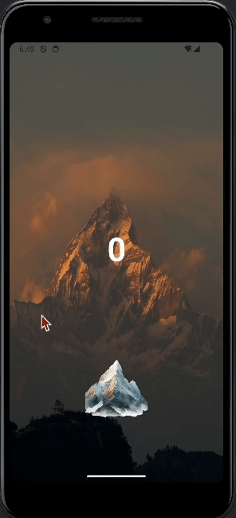

# Lab 1: Tap Counter App

Course Link: [CodePath Android Course](https://courses.codepath.org/courses/and102/unit/1#!labs)

Submitted by: **Tsewang Sherpa** <!-- Replace 'Your Name Here' with your actual name -->

**Tap Counter App** is an Android app inspired by idle tap games, allowing users to accumulate points through taps, which can be exchanged for upgrades.

Time spent: **1** hours spent in total <!-- Replace 'X' with the number of hours you spent on this project -->

## Required Features

The following **required** functionality is completed:

- [X] **User can see a number displayed on the screen. The number starts at 0.**
- [X] **User can tap on a button to see the number displayed increase by 1.**
      
    - 

## Stretch Features

The following **optional** features are implemented:

- [X] User can exchange number of taps accumulated for upgrades (e.g., each tap counts as 2 taps).
- [X] User can customize the app's theme (e.g., using a dog background and a paw print button).
      
   - 

## Notes

It was challenging to figure out the background image for button, when using Button Tag, only image's outline was showing with purple background color. However, ImageButton Tag fixed the issue and I was able to display Mountain pic as button. <!-- Replace this with your specific challenges and experiences -->

## License

    Copyright [2024] [Tsewang Sherpa]

    Licensed under the Apache License, Version 2.0 (the "License");
    you may not use this file except in compliance with the License.
    You may obtain a copy of the License at

        http://www.apache.org/licenses/LICENSE-2.0

    Unless required by applicable law or agreed to in writing, software
    distributed under the License is distributed on an "AS IS" BASIS,
    WITHOUT WARRANTIES OR CONDITIONS OF ANY KIND, either express or implied.
    See the License for the specific language governing permissions and
    limitations under the License.
